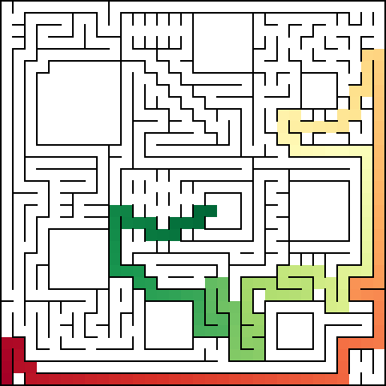
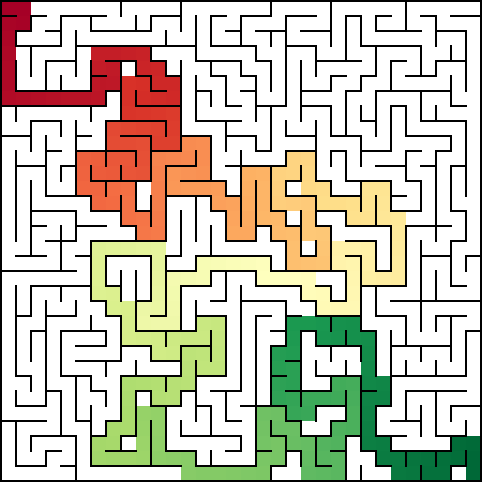

.. currentmodule:: maze

Usage Examples
==============

Examples of use.

Load and display a maze
-----------------------

Create an instance of :class:`Utilities`. To load and display a maze, call the :meth:`~Utilities.load_maze()` and :meth:`~Utilities.show_maze()` methods.

.. code-block:: python
    :linenos:

    from maze import Maze, Utilities

    maze = Maze()
    utils = Utilities(maze)
    utils.load_maze("resources/2015apec.maze")
    utils.show_maze()

Solve a maze and display its solution
-------------------------------------

Create an instance of :class:`Utilities`. Load or generate a maze. To solve the maze and display its solution, call the :meth:`~Utilities.solve_maze()` and :meth:`~Utilities.show_solution()` methods.

.. code-block:: python
    :linenos:

    from maze import Maze, Utilities

    maze = Maze()
    utils = Utilities(maze)
    utils.load_maze("resources/2019japan.maze")
    utils.solve_maze()
    utils.show_solution()

Generate a maze and display its solution
----------------------------------------

Create an instance of :class:`Utilities`. To generate a maze, call the :meth`generate_maze()` method and pass the row and column counts as arguments. Set the start and goal cells by calling :meth:`~Maze.set_start_cell()` and :meth:`~Maze.set_goal_cell()` methods and passing the location as arguments. Refer to the previous section to solve the maze and display its solution.

.. code-block:: python
    :linenos:

    from maze import Maze, Utilities

    maze = Maze()
    utils = Utilities(maze)
    utils.generate_maze(32, 32)
    utils.maze.set_start_cell(0, 0)
    utils.maze.set_goal_cell(31, 31)
    utils.solve_maze()
    utils.show_solution()

